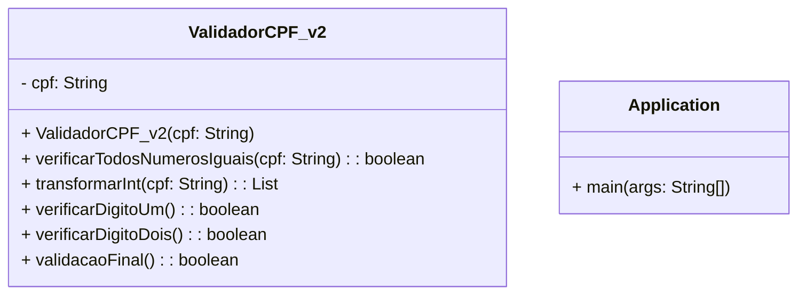

## Documentação do Projeto Validador de CPF

---

### Sobre

O projeto Validador de CPF é uma biblioteca Java que permite a validação de números de CPF (Cadastro de Pessoas Físicas) no Brasil. Ele fornece uma maneira fácil e confiável de verificar se um CPF é válido de acordo com as regras estabelecidas pela Receita Federal.

---

### Tecnologia(s) utilizada(s):
##### Back-End
- Java 17

---

### Versões

ValidadorCPF_v1 (Não recomendada)

        - ➡️ ValidadorCPF_v1
                - 🔸 A versão 1 do Validador de CPF é considerada precária e não deve ser utilizada. 
                O código dessa versão apresenta problemas de legibilidade, manutenção e eficiência. 
                Além disso, não possui tratamento adequado para exceções e pode gerar resultados 
                inconsistentes. 

                Recomendamos que você evite utilizar essa versão e opte pela versão 2, 
                que traz melhorias significativas.

ValidadorCPF_v2 (Recomendado) 

        - ➡️ ValidadorCPF_v2
                - 🔸 A versão 2 do Validador de CPF representa uma melhoria significativa em relação 
                à versão anterior. O código foi reescrito com foco na clareza, organização e eficiência. 
                Ele utiliza boas práticas de programação, possui tratamento adequado de exceções e 
                implementa algoritmos otimizados para validar os dígitos verificadores do CPF.

                Ao utilizar a versão 2, você pode esperar um código mais limpo, legível e de fácil 
                manutenção. Além disso, essa versão foi aprimorada para oferecer maior precisão e 
                confiabilidade na validação de CPFs.

                Recomendamos o uso da versão 2 do Validador de CPF em seus projetos, aproveitando 
                as melhorias introduzidas para obter resultados mais consistentes e confiáveis na 
                validação de CPFs.

API de Validação de CPF - Em Breve 

        - ➡️ Em Breve...

---

### Diagrama de Classe(s)

---

### Uso

A classe principal deste projeto é a `ValidadorCPF_v2`, que possui os métodos necessários para a validação de CPF. Siga as instruções abaixo para utilizar a biblioteca em seu projeto:

**1.** Importe a classe `ValidadorCPF_v2` para o seu código:
~~~Java
import ValidadorCPF_v2.ValidadorCPF_v2;
~~~

**2.** Crie uma instância da classe `ValidadorCPF_v2`, passando o número de CPF como parâmetro no construtor:
~~~Java
String cpf = "12345678901"; // Número de CPF a ser validado
ValidadorCPF_v2 validadorCPF = new ValidadorCPF_v2(cpf);
~~~

**3.** Chame o método `validacaoFinal()` para realizar a validação do CPF:
~~~Java
boolean cpfValido = validadorCPF.validacaoFinal();
~~~
O método validacaoFinal() retorna true se o CPF for válido e false caso contrário.

---

### Exceções

Durante o processo de validação, podem ocorrer exceções que sinalizam situações inválidas ou erros específicos. Abaixo estão as exceções lançadas pela classe `ValidadorCPF_v2`:

- **IllegalArgumentException:** lançada quando o CPF não é informado ou está vazio.
- **RuntimeException:** lançada quando o CPF contém caracteres que não são números ou possui tamanho incorreto.

---

### Métodos

`boolean verificarDigitoUm()`
- Este método verifica o primeiro dígito verificador do CPF. Retorna `true` se o dígito é válido e `false` caso contrário.

`boolean verificarDigitoDois()`
- Este método verifica o segundo dígito verificador do CPF. Retorna `true` se o dígito é válido e `false` caso contrário.

`boolean validacaoFinal()`
- Este método realiza a validação completa do CPF, verificando tanto o primeiro quanto o segundo dígito verificador. Retorna `true` se o CPF é válido e `false` caso contrário.

---

### Exemplo completo

Aqui está um exemplo completo de como utilizar a biblioteca para validar um CPF:
~~~Java
import ValidadorCPF_v2.ValidadorCPF_v2;

public class Main {
    public static void main(String[] args) {
        String cpf = "INFORME O CPF, COM OU SEM PONTUAÇÃO"; // Número de CPF a ser validado
        ValidadorCPF_v2 validadorCPF = new ValidadorCPF_v2(cpf);

        boolean cpfValido = validadorCPF.validacaoFinal();
        if (cpfValido) System.out.println("CPF válido!");
        else {
            System.out.println("CPF inválido!");
        }

    }
}
~~~

---

### Considerações finais
O projeto Validador de CPF é uma solução útil e confiável para a validação de números de CPF no Brasil. Ele oferece uma implementação simples e eficiente, garantindo a conformidade dos CPFs de acordo com as regras estabelecidas.

---

#### Autor

Mateus dos Santos Silva

  
<a href="https://www.linkedin.com/in/dev-mateussilva/" target="_blank">

 
